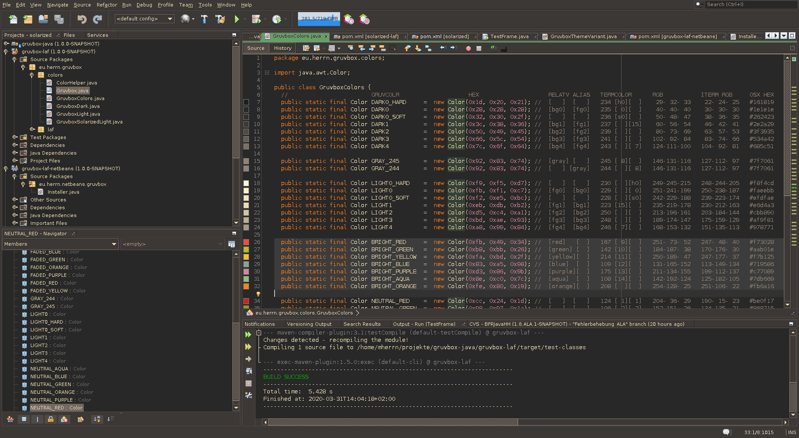

Gruvbox Look & Feel for Java
============================
Marco Herrn <marco@mherrn.de>
2018-12-27
:notoc:
:homepage: https://github.com/hupfdule/gruvbox-java/
:gruvbox-homepage: https://github.com/morhetz/gruvbox
:download-page: https://github.com/hupfdule/gruvbox-java/releases
:issue-page: https://github.com/hupfdule/gruvbox-java/issues
:netbeans-homepage: http://netbeans.apache.org/
:source-highlighter: prettify
:version: 1.0.0-SNAPSHOT

Gruvbox Look & Feel for Java and Netbeans inspired by the
{gruvbox-homepage}[Gruvbox Colorscheme for Vim].

This project provides three artifacts that are meant to be used together,
but can as well be used each on their own:
                                   j
gruvbox-laf:: A Java Swing Look and Feel

gruvbox-laf-netbeans:: A Look and Feel for the {netbeans-homepage}[Netbeans IDE]
+
This Look & Feel is intended to be used together with the
corresponding netbeans colorscheme.

gruvbox-netbeans-colorscheme:: A colorscheme for syntax highlighting in the {netbeans-homepage}[Netbeans IDE]

WARNING: This Look & Feel is still a work in progress and may contain some
glitches. Please file an {issue-page}[Issue] if find any.

.Example screenshot of Netbeans running with Gruvbox Look & Feel
[link=netbeans-gruvbox.png]

Variants
--------

This Look & Fell provides different variants (dark and light) of Gruvbox.
However, the gruvbox-netbeans-colorscheme is only available in a single
dark variant at the moment.

References
----------

The gruvbox-netbeans-colorscheme is derived from the work in
https://github.com/Ghosty141/gruvbox-netbeans.

License
-------

Permission is hereby granted, free of charge, to any person obtaining a copy of
this software and associated documentation files (the "Software"), to deal in
the Software without restriction, including without limitation the rights to
use, copy, modify, merge, publish, distribute, sublicense, and/or sell copies
of the Software, and to permit persons to whom the Software is furnished to do
so, subject to the following conditions:

The above copyright notice and this permission notice shall be included in all
copies or substantial portions of the Software.

THE SOFTWARE IS PROVIDED "AS IS", WITHOUT WARRANTY OF ANY KIND, EXPRESS OR
IMPLIED, INCLUDING BUT NOT LIMITED TO THE WARRANTIES OF MERCHANTABILITY,
FITNESS FOR A PARTICULAR PURPOSE AND NONINFRINGEMENT. IN NO EVENT SHALL THE
AUTHORS OR COPYRIGHT HOLDERS BE LIABLE FOR ANY CLAIM, DAMAGES OR OTHER
LIABILITY, WHETHER IN AN ACTION OF CONTRACT, TORT OR OTHERWISE, ARISING FROM,
OUT OF OR IN CONNECTION WITH THE SOFTWARE OR THE USE OR OTHER DEALINGS IN THE
SOFTWARE.
